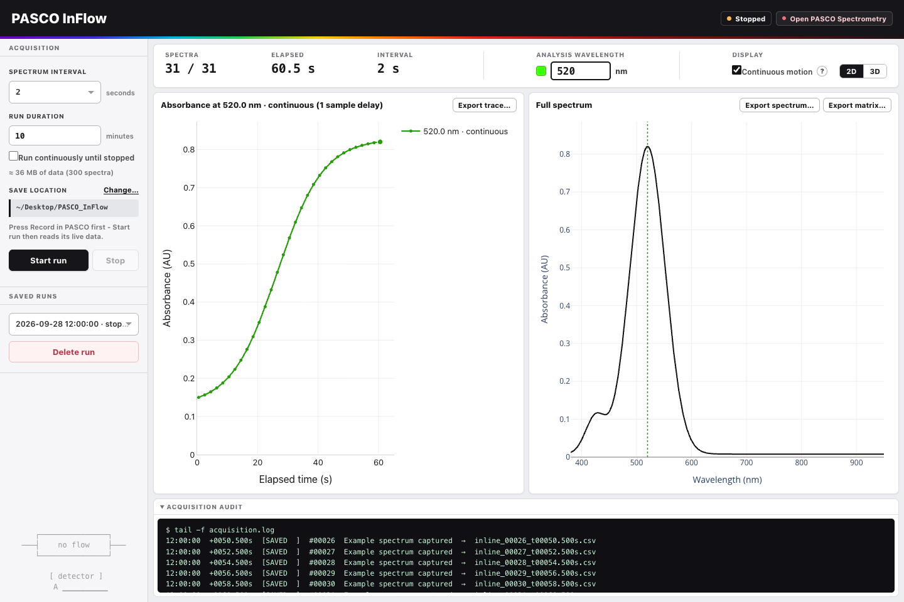

# PASCO InFlow

Live absorbance monitoring for a PASCO PS-2600A spectrometer during flow experiments. The dashboard follows the calibrated spectra produced by PASCO Spectrometry, saves each full spectrum, and plots absorbance at a wavelength you can change during or after a run.

*Dashboard shown with illustrative data.*

## Download

For an Apple Silicon Mac, download **PASCO_InFlow.zip** from the [latest release](https://github.com/glebo309/pasco-inflow/releases/latest). The package includes Python and its dependencies, so the first launch works offline. Unzip it and follow `START_HERE.txt` inside the folder.

PASCO Spectrometry must be installed. Connect the spectrometer by USB, open Spectrometry, and start recording there. Then double-click `PASCO InFlow Dashboard.command` and press **Start run** in the dashboard. Keep the launcher window open during acquisition.

## What it saves

Each run gets a folder in `~/Desktop/PASCO_InFlow/` by default. It contains the individual calibrated spectrum CSV files, a consolidated spectrum matrix, timing and status files, and an acquisition log. The dashboard also exports the selected wavelength trace and latest spectrum directly.

The wavelength control recalculates the trace from the saved full spectra. The display's continuous motion setting changes only the presentation; saved CSV values remain unchanged.

## Run from source

On macOS with Python 3 installed, clone this repository and double-click `PASCO InFlow Dashboard.command`. The launcher creates a private environment and installs the packages in `requirements-dashboard.txt` on first use. An internet connection is needed for that first installation.

The source package and the downloadable release contain the same dashboard code. The release adds a bundled Apple Silicon Python and dependency wheels for offline setup.

## Compatibility

PASCO InFlow has been used with the PS-2600A and PASCO Spectrometry on macOS. It reads PASCO's live calibrated data while Spectrometry records. The dashboard does not acquire or calibrate raw detector data itself. PASCO's internal live data layout can change with a Spectrometry update, so check a saved spectrum against the official application after updating it.
